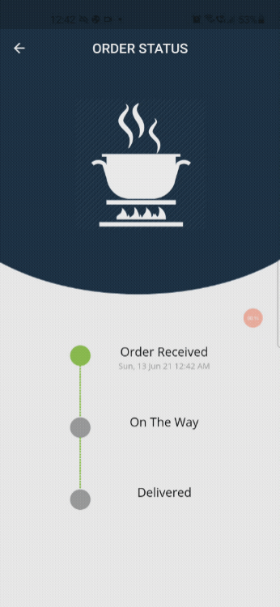
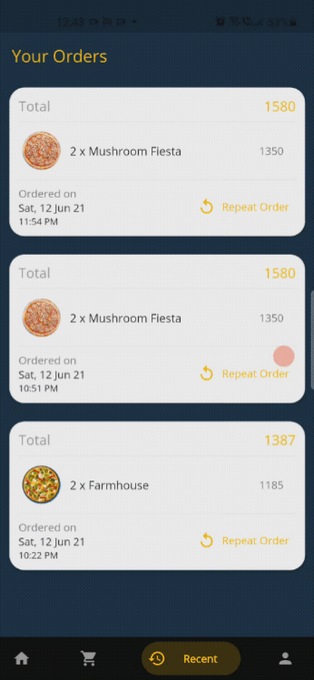

# FoodMagic ✨

**An Augmendted Reailty app Food app built with Flutter and AR**

FoodMagic is an unique take on food delivery using augmented reailty and stunning UI.

**Features**

- [x] Food Items Display
- [x] Cart service
- [x] Order Status with realtime updates
- [x] Recent Orders
- [x] Profile Service
- [x] AR View using Google AR core
- [x] Profile Service
- [ ] Ingredients Screen
- [ ] Review and Rating Service
- [ ] Delivery tracking using Maps

<pre>
    
</pre>

**Tech Stack**


**Flutter**

- Riverpod and Flutter Hooks to manage state of the app.
- Auto Route for navigation.
- Sembast as a local database.
- arcore_flutter_plugin for displaying 3D models in AR.
- Running on UnSound Null-Safety as arcore_flutter_plugin is not nullsafe.

**Appwrite**

- Appwrite accounts for authentication and session managament.
- Appwrite database for storing all the data.
- Appwrite Storage for storing images.
- Appwrite functions for simulating order status change.
- Appwrite SMTP and email verification to verify user account.

### Setup and Development

If you wish to contribute to this repository, please fork the repository, make your chnages on a new branch and make a pull request.

To View AR scenes, please ensure you have Google AR core services enabled on your phone.

**Setup AppWrite (version 0.8.0 required)**

**Initial Steps**

[AppWrite](https://appwrite.io) is required to run this project succesfully.

FoodMagic uses AppWrite as a backend as a service for storing data, authentication and file storage.

Once you have appwrite successfully running as a docker container,

- Create a new Project, name it foodmagic
- Click on add app and select Flutter
- Enter the app details, be sure enter `com.example.foodmagic` as the domain
- Go to Project settings and copy your `projectId`
- Navigate to the flutter project, which is at `FoodMagic/foodmagic`
- Copy `project_id`, colletion ids and other variabales into `env.dart`
- If you're running on an emulator, insert `localhost` as the value for `IP` else use the IP adress of you PC if you're using a physical device.
- make sure to set Appwrite env variable `_APP_OPTIONS_FORCE_HTTPS=disabled` to load images succesfully.

**Run Scripts**

- from the root of the project directory, `cd scripts/`
- replace the environment variables with your project values
- run `dart bin/scripts.dart`
- once the script finished succesfully, visit the console and click on orders collection
- click on settings and for the field `orderItems`, edit and select type as `document`, and choose the `orderItems` sub collection as the option.
- you're ready to start querying your database.

**Setup Functions**

- install the [appwrite cli](https://appwrite.io/docs/command-line)
- `appwrite init` in the scripts folder and paste `project id` and `api key`
- execute `export PUB_CACHE=.appwrite` and `dart pub get`
- The cache will now be stored within scripts.
- head over to functions in the console and create a new function with Dart 2.12 as the runtime.
- if you don't see it, open the .env file from your home directory where appwrite install was run
- add `dart-2.12` as a variable next to other languge runtimes.
- restart the containers with `docker compose up -d`.
- copy the function id and run from scripts/ folder

```zsh
 appwrite functions createTag \
    --functionId= <your function id> \
    --command='dart main.dart' \
    --code='./'
```

- once the tag is created, activate the function and execute to test it.
- Make an order from the app to test the orderStatus function.
